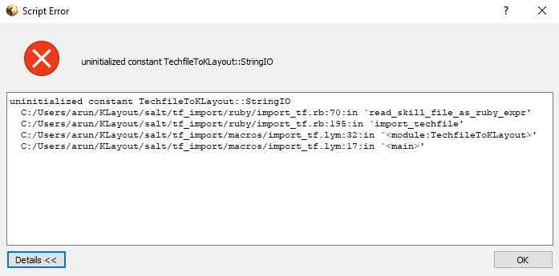
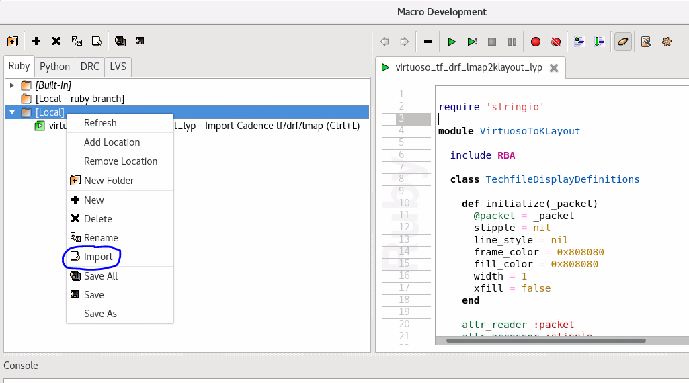
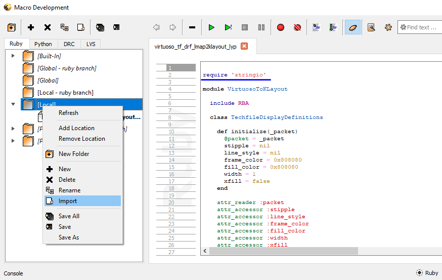
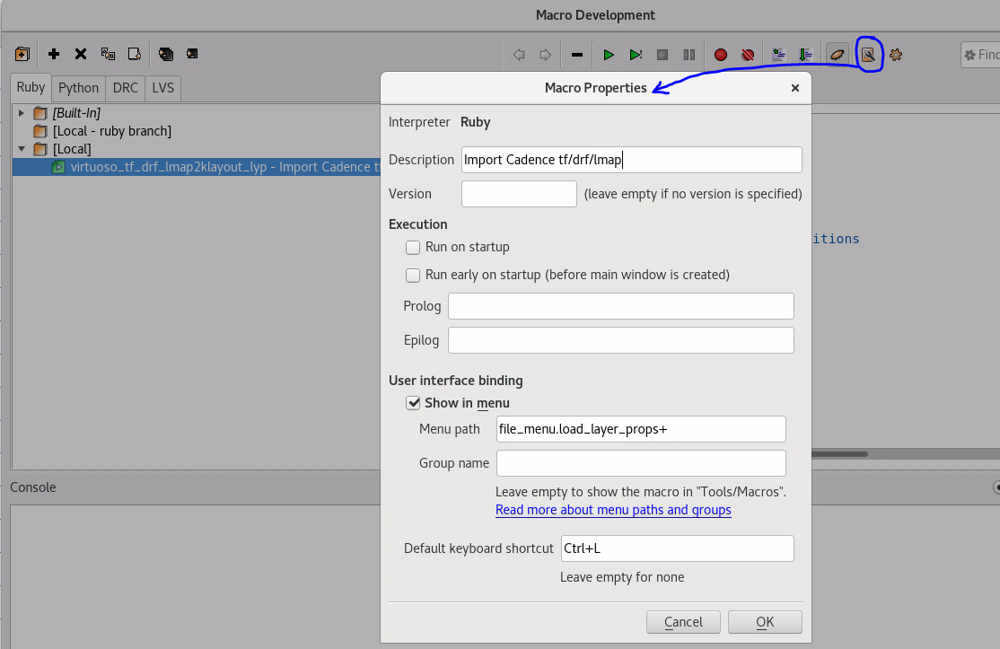
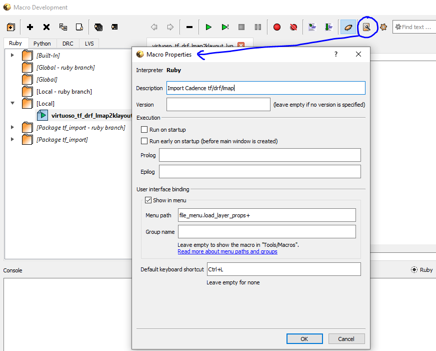
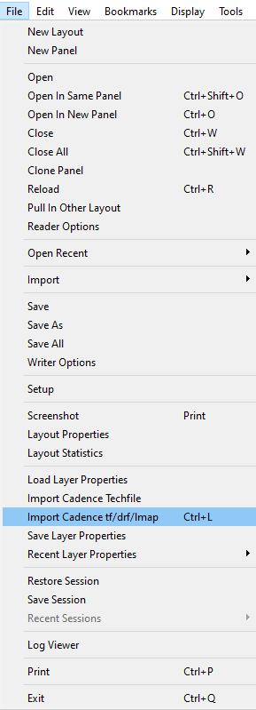

# virtuoso_lmap2klayout_lyp
Converts Cadence Virtuoso layer map (`.map`) file to KLayout layer properties (`.lyp`) file

## Usage
To have KLayout display the layer names and data types used in a GDSII file a layer properties `.lyp` file needs to be supplied. The C shell script and KLayout macro in this repo can be used to generate a `.lyp` from following Cadence Virtuoso files:
- layer map file (`.map`) : Contains 4 columns of data - layer name, purpose, stream number and data type.
- technology file (`.tf`) : Contains info similar to `.map` along with SKILL code and usually also interconnect/routing layer min/max limits.
- display resource file (`.drf`) : Contains layer colors and stipple patterns that will be used to display those layers in the Virtuoso Layout viewer.

After loading a GDSII file in KLayout there are 2 ways to have the layer numbers and data types show up in the layer info side panel.

**A) Convert Virtuoso .map to .lyp and then load in KLayout:** 

Use the script `virtuoso_lmap2klayout_lyp.csh` to generate a simplified layer properties file out of the Virtuoso layer map file. This is an XML format file that will preserve the names, stream numbers and stream data types but will ignore the colors and stipple patterns. *The default color palette of KLayout will be applied when this `.lyp` is loaded in KLayout.*

Run the script in a Linux terminal and pass the path to the Virtuoso layer map file as a command line argument:
```
./virtuoso_lmap2klayout_lyp.csh <virtuoso.map>
```
The default filename for the `.lyp` that is generated is `klayout.lyp` and this can be customized by altering the following variable assignment in the script:
```
set klayout_lyp="klayout.lyp"
```

**B) Load Virtuoso .tf, .drf, .map directly in KLayout:** 

The [tf_import macro](https://github.com/klayoutmatthias/tf_import) provided by KLayout developer can be used to load Cadence tech file, `.drf` and `.map`. To install this macro:
1. Go to Tools menu option
2. Open Manage Packages
3. Search for the package under Install New Packages, select it and click on the checkmark above
4. Click Apply

Once the macro is installed a new option appears under File menu named `Import Cadence Techfile`. Use this option to supply the `.tf`, `.layermap` and `.drf`.

In KLayout 0.27.11 the Ruby macro crashes after importing the `.tf`, `.layermap` and `.drf` with this error:



The `virtuoso_tf_drf_lmap2klayout_lyp.lym` in this repo fixes this issue by placing a `require 'stringio'` at the top. Additionally, instead of looking for `.layermap` file it loads `.map` file.

To install the macro `.lym` file available in this repo:

1. Go to KLayout's Macros menu option -> Macro Development
2. Select Ruby radio button at the bottom, right click on the Local folder and choose Import to import the .lym

    **On Linux:**

    Local macro get saved to */home/\<user\>/.klayout/macros/*
    
    **On Windows:**

    Local macros get saved to *C:\\Users\\\<user\>\\KLayout\\macros\\*
    
3. Double click the macro name and when its contents are visible in the macro editor select the Edit Macro Properties menu option. Ensure the macro properties and shortcut key are set to desired values.

    **On Linux:**

    
    **On Windows:**

    

4. Save the macro and this will enable a new option under File menu named `Import Cadence tf/drf/lmap (Ctrl+L)`.

    

Using this new `Import Cadence tf/drf/lmap (Ctrl+L)` will allow you to point to .tf, .map and .drf and have the layer side panel of KLayout populated with the correct layer names, stream numbers, data types, colors and stipple pattern. A `.lyp` can then be generated out of the contents of the layer side panel using File->Save Layer Properties. 